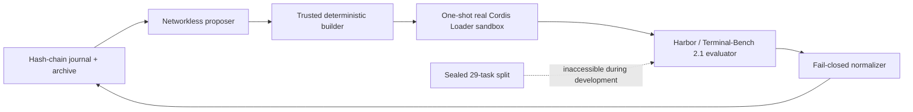

# dsh-evolve-le

[English](README.md) | [简体中文](README.zh-CN.md)

An evidence-first, crash-resumable recursive self-improvement (RSI) engine for
[DeepSeek Harness](https://github.com/deepseek-ai/DeepSeek-Harness). It proposes bounded Cordis plugin
candidates, admits each through a real one-shot Cordis Loader sandbox, evaluates them with Harbor on
Terminal-Bench 2.1, and keeps a hash-chained, content-addressed evidence trail from proposal to
admission.

> [!IMPORTANT]
> This repository is a re-implementation of the specifications of the predecessor project
> `dsh-self-evolving` ([`timwhitez/dsh-self-evolving`](https://github.com/timwhitez/dsh-self-evolving) @ `6324afd`).
> Implementation Gates 0–6 are accepted with recorded evidence (see [`PROJECT_STATUS.md`](PROJECT_STATUS.md));
> Gates 7 (this release candidate) ships installability and docs. **No sealed-benchmark unblinding has
> happened and no benchmark improvement is claimed.** The only authoritative statement of what may be
> claimed today is [`PROJECT_STATUS.md`](PROJECT_STATUS.md).

## Why this project exists

Self-modifying agent systems are easy to demo and hard to trust. `dsh-evolve-le` treats every
candidate as untrusted: the model adapter, verifier, dataset split, scorer, controller, budget and
safety policy form a trusted computing base (TCB) that candidates cannot write. A result is accepted
only when its source identity, evidence, cost, lifecycle and recovery path reconcile. The whole loop
is TypeScript, carried by standard DSH Cordis bundles/services — no Python agent bridge.



## Status

| Gate | Outcome                                                                                    | State                       |
| ---- | ------------------------------------------------------------------------------------------ | --------------------------- |
| 0–4  | Loader admission, candidate SDK, Harbor ACP provider, durable controller, agentic proposer | accepted, evidence recorded |
| 5    | productized iteration closure behind one CLI                                               | accepted, evidence recorded |
| 6    | real K=3 multi-generation crash/resume stability proof                                     | accepted, evidence recorded |
| 7    | installable open-source v0.1 release candidate                                             | this release (`0.1.0-rc.1`) |
| 8    | continuous Terminal-Bench improvement                                                      | optional, not run           |

## Quickstart (5 commands)

Verified on Ubuntu 24.04 (also WSL2) with Node.js ≥ 22.19, pnpm ≥ 11.7, Docker:

```bash
pnpm install                     # workspace dependencies
pnpm setup:source                # materialize pinned upstreams + Terminal-Bench source
pnpm build                       # TypeScript project build
pnpm provenance:check            # upstream commits, versions, toolchain match the lockfile
pnpm install:verify              # full fresh-profile drill: install → build → Loader smoke →
                                 #   K=3 demo (fake provider) → snapshot-loss restore → uninstall
```

`pnpm install:verify` proves the documented install path end-to-end on a clean profile: it extracts
the release tarball into a fresh HOME/pnpm-store, installs with `--frozen-lockfile`, builds, runs the
real Cordis Loader smoke, drives a default-config K=3 iteration to `STABLE_ITERATION_VERIFIED`,
deletes every snapshot plus the drive report and reconstructs identical state from the journal, then
uninstalls.

For real Terminal-Bench runs see the [quickstart](docs/quickstart.md); for the run directory and how
to read it see the [evidence guide](docs/evidence-guide.md).

## Documentation

- [Architecture overview](docs/architecture-overview.md) — packages, data flow, TCB boundary
- [Quickstart](docs/quickstart.md) — from clone to first real iteration
- [Configuration](docs/configuration.md) — the frozen `run.config.json` reference
- [Operations](docs/operations.md) — stop, resume, restore, rollback, uninstall
- [Troubleshooting](docs/troubleshooting.md) — fail-closed diagnostics and common failures
- [Evidence guide](docs/evidence-guide.md) — what each artifact proves, and what it does not
- [Terminal-Bench 2.1 runbook](docs/terminal-bench-2.1-runbook.md) — fixed Harbor/TB facts
- [Documentation index](docs/README.md) — everything else, including historical records

Normative sources: [`specs/00`–`specs/07`](specs/) (product, architecture, candidate contract,
algorithm, evaluation, safety, evidence, gates) and [`PROJECT_STATUS.md`](PROJECT_STATUS.md).

## Safety model (short version)

- Candidates run only in one-shot isolated processes through the real Cordis Loader — never inside
  the controller, never via `node:vm`.
- The 29 sealed tasks stay inaccessible until candidate hashes are frozen; unblinding happens once.
- Missing, corrupt, timed-out or unattributable results count as failures; failed trials are kept.
- Every external version, route, parameter, seed, budget and artifact is content-addressed in the
  run manifest; credentials never enter candidates, logs, prompts or evidence.
- Budgets are enforced in µUSD/tokens/calls/trials with a fail-closed ledger.

Details: [`specs/05-safety.md`](specs/05-safety.md).

## License

[MIT](LICENSE) © 2026 Yuhang Le. Pinned upstream checkouts (`deepseek-harness/`, `harbor/`, `tb/`)
keep their own licenses and are not part of the released source tree.

## Contributing / security

See [CONTRIBUTING.md](CONTRIBUTING.md), [SECURITY.md](SECURITY.md) and
[CODE_OF_CONDUCT.md](CODE_OF_CONDUCT.md). Release artifacts (tarball, checksums, SPDX SBOM, scans)
are produced by `pnpm release:artifacts` from the committed tree.
