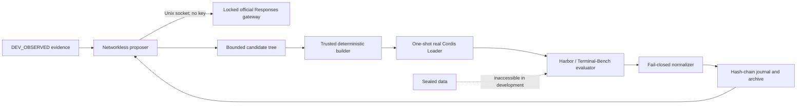

# dsh-evolve-le

[English](README.md) | [简体中文](README.zh-CN.md)

An evidence-first, crash-resumable self-evolution engine for
[DeepSeek Harness](https://github.com/deepseek-ai/DeepSeek-Harness). It generates bounded Cordis plugin candidates,
runs them through isolated real-Loader admission, evaluates them with Harbor, and preserves an auditable lineage.

> [!IMPORTANT]
> This repository is a **fresh re-implementation** based on the specifications of the predecessor project
> `dsh-self-evolving` ([`timwhitez/dsh-self-evolving`](https://github.com/timwhitez/dsh-self-evolving) @ `6324afd`).
> No implementation, tests, or run evidence exist here yet; every gate in [`specs/07`](specs/07-implementation-plan.md)
> is pending. The only authoritative statement of what may be claimed today is
> [`PROJECT_STATUS.md`](PROJECT_STATUS.md).

## Why this project exists

Self-modifying agent systems are easy to demo and hard to trust. `dsh-evolve-le` treats every candidate as untrusted
and makes the controller, evaluator, budget, dataset split, and safety policy part of a trusted computing base. A
result is accepted only when its source identity, evidence, cost, lifecycle, and recovery path reconcile.

The project is a standard DSH Cordis plugin/service—not a fork of DSH and not a second controller wrapped around it.

## Planned architecture

- The controller is the only durable writer.
- Provider credentials stay in the trusted host and never enter the proposal sandbox or candidate.
- Candidates may change only their declared package; evaluator, scorer, split, route, and safety policy are fixed.
- Every external action is journaled before launch and reconciled exactly once after restart.

See [Architecture overview](docs/architecture-overview.md) and the [trust-boundary specification](specs/05-safety.md).

## Roadmap

Implementation follows the vertical-slice gates defined in [`specs/07-implementation-plan.md`](specs/07-implementation-plan.md):
provenance + real Loader lifecycle (Gate 0) → candidate SDK and builder (Gate 1) → Harbor ACP smoke (Gate 2) →
crash-safe journal/archive/budget (Gate 3) → proposal sandbox and one child end-to-end (Gate 4) → iteration CLI
closure (Gate 5) → stable real iteration proof (Gate 6) → release candidate (Gate 7). Each gate must produce
implementation, automated tests, real runtime evidence, and a `PROJECT_STATUS.md` update before the next one starts.

Operational documents under [`docs/`](docs/) (quickstart, configuration, operations, runbooks) describe the
**predecessor's completed system** and serve as the reference contract for this re-implementation; their commands do
not work in this repository until the corresponding gates land.

## Documentation

| Start here                                     | Purpose                                                                      |
| ---------------------------------------------- | ---------------------------------------------------------------------------- |
| [Documentation index](docs/README.md)          | Find setup, architecture, operation, evidence, and release documents         |
| [Specifications](specs/)                       | Normative product, architecture, algorithm, evaluation, and safety contracts |
| [Project status](PROJECT_STATUS.md)            | Current accepted state and claim boundaries                                  |
| [Architecture](docs/architecture-overview.md)  | Components, data flow, and isolation boundaries                              |
| [Evidence guide](docs/evidence-guide.md)       | What each artifact proves—and does not prove                                 |
| [DSH integration](docs/dsh-integration.md)     | Source-verified Cordis and Loader contracts                                  |
| [DSH upstream policy](docs/upstream-policy.md) | Reproducible pinning and the latest compatibility channel                    |

When documents disagree, precedence is: frozen run manifest → specifications → operational docs → README →
historical discussion.

## Project boundaries

- DSH, Harbor, and Terminal-Bench checkouts are pinned read-only upstreams, recorded in
  [`provenance.lock.json`](provenance.lock.json) (deepseek-harness `47f9438`, harbor `ac398bb`, terminal-bench
  `d28711d`).
- Development evidence may guide iteration; concealed and sealed evaluation data may not.
- Archive admission, development champion, sealed promotion, and full-set leaderboard are distinct states; no
  intermediate green light substitutes for a later gate.
- K=10/K=80 search, sealed confirmation, full-set evaluation, and leaderboard submission are optional post-release
  profiles and are not part of the initial acceptance claim.
- This repository does not authorize financial trading or real-world order execution.

## Contributing

Read [CONTRIBUTING.md](CONTRIBUTING.md) before opening a pull request. Changes to protocols, trust boundaries,
provider routes, splits, metrics, or retry semantics require an ADR and a fresh run lineage.

## License

Licensed under [Apache License 2.0](LICENSE). DeepSeek Harness, Harbor, Terminal-Bench, and their dependencies retain
their respective licenses and trademarks.
