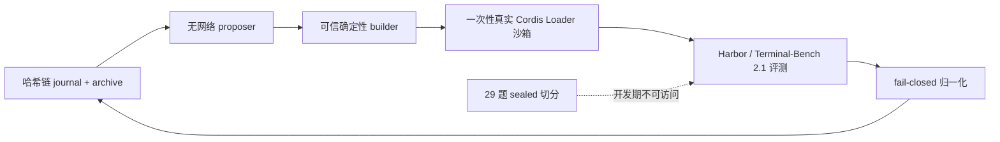

# dsh-evolve-le

[English](README.md) | [简体中文](README.zh-CN.md)

一个证据优先、可崩溃恢复的递归自改进（RSI）引擎，面向
[DeepSeek Harness](https://github.com/deepseek-ai/DeepSeek-Harness)。它生成有界的 Cordis 插件候选，
让每个候选通过一次性隔离进程中的真实 Cordis Loader 准入，用 Harbor 在 Terminal-Bench 2.1 上评测，
并保留从 proposal 到 admission 的哈希链、内容寻址证据。

> [!IMPORTANT]
> 实现 Gate 0–6 已随记录证据验收（见 [`PROJECT_STATUS.md`](PROJECT_STATUS.md)）；Gate 7（本发布候选）交付可安装性与文档。
> **尚未发生 sealed benchmark 揭盲，也不声称任何 benchmark 提升。**当前可以声称什么的唯一权威表述是
> [`PROJECT_STATUS.md`](PROJECT_STATUS.md)。

## 项目存在的理由

自修改的 agent 系统容易演示、难以信任。`dsh-evolve-le` 把每个候选都视为不可信：model adapter、
verifier、数据集切分、scorer、controller、预算和安全策略构成候选不可写的可信计算基（TCB）。只有当
来源身份、证据、成本、生命周期和恢复路径全部对账一致时，结果才被接受。整个闭环只用 TypeScript，
由标准 DSH Cordis bundle/service 承载——没有 Python agent bridge。



## 状态

| Gate | 结果                                                                                  | 状态                   |
| ---- | ------------------------------------------------------------------------------------- | ---------------------- |
| 0–4  | Loader 准入、candidate SDK、Harbor ACP provider、durable controller、agentic proposer | 已验收，证据已记录     |
| 5    | 单 CLI 产品化的迭代闭环                                                               | 已验收，证据已记录     |
| 6    | 真实 K=3 多代崩溃/恢复稳定性证明                                                      | 已验收，证据已记录     |
| 7    | 可安装的开源 v0.1 发布候选                                                            | 本发布（`0.1.0-rc.1`） |
| 8    | 持续 Terminal-Bench 提升                                                              | 可选，未运行           |

## 快速开始（5 条命令）

在 Ubuntu 24.04（含 WSL2）、Node.js ≥ 22.19、pnpm ≥ 11.7、Docker 上验证：

```bash
pnpm install                     # workspace 依赖
pnpm setup:source                # 物化 pinned 上游 + Terminal-Bench 源码
pnpm build                       # TypeScript 工程 build
pnpm provenance:check            # 上游 commit、版本、工具链与 lockfile 一致
pnpm install:verify              # 全量 fresh-profile 演练：install → build → Loader 冒烟 →
                                 #   K=3 demo（fake provider）→ 快照丢失恢复 → 卸载
```

`pnpm install:verify` 在干净 profile 上端到端验证文档化的安装路径：把发布 tarball 解压到全新的
HOME/pnpm-store，用 `--frozen-lockfile` 安装、build、跑真实 Cordis Loader 冒烟，用默认配置把 K=3
迭代推到 `STABLE_ITERATION_VERIFIED`，随后删除全部快照和 drive report 并从 journal 重建出相同状态，
最后卸载。

真实 Terminal-Bench 运行见[快速开始](docs/quickstart.md)；run 目录结构与解读见
[证据指南](docs/evidence-guide.md)。

## 文档

- [架构总览](docs/architecture-overview.md) — 包结构、数据流、TCB 边界
- [快速开始](docs/quickstart.md) — 从 clone 到第一次真实迭代
- [配置参考](docs/configuration.md) — 冻结的 `run.config.json` 字段表
- [运维手册](docs/operations.md) — 停止、恢复、还原、回滚、卸载
- [故障排查](docs/troubleshooting.md) — fail-closed 诊断与常见失败
- [证据指南](docs/evidence-guide.md) — 每个产物证明什么、不证明什么
- [Terminal-Bench 2.1 runbook](docs/terminal-bench-2.1-runbook.md) — Harbor/TB 固定事实
- [文档索引](docs/README.md) — 其余文档与历史记录

规范唯一真源：[`specs/00`–`specs/07`](specs/)（产品、架构、候选契约、算法、评测、安全、证据、
实施门）与 [`PROJECT_STATUS.md`](PROJECT_STATUS.md)。

## 安全模型（简版）

- 候选只在一次性隔离进程中通过真实 Cordis Loader 运行——绝不进入 controller，也不用 `node:vm`。
- 29 个 sealed task 在候选哈希冻结前不可访问；揭盲只发生一次。
- 缺失、损坏、超时或不可归因的结果一律记失败；失败 trial 保留不丢弃。
- 所有外部版本、路由、参数、种子、预算和 artifact 都内容寻址写入 run manifest；凭据不进入候选、
  日志、prompt 或证据。
- 预算以 µUSD/token/call/trial 记账并 fail-closed 执行。

细则：[`specs/05-safety.md`](specs/05-safety.md)。

## 许可证

[MIT](LICENSE) © 2026 Yuhang Le。Pinned 上游 checkout（`deepseek-harness/`、`harbor/`、`tb/`）保留
各自许可证，不属于发布源码树的一部分。

## 参与贡献 / 安全

见 [CONTRIBUTING.md](CONTRIBUTING.md)、[SECURITY.md](SECURITY.md) 与
[CODE_OF_CONDUCT.md](CODE_OF_CONDUCT.md)。发布产物（tarball、checksums、SPDX SBOM、扫描报告）由
`pnpm release:artifacts` 从已提交树生成。
