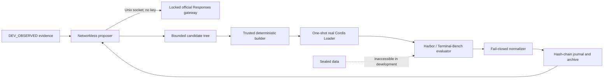

# dsh-evolve-le

[English](README.md) | [简体中文](README.zh-CN.md)

一个证据优先、可崩溃恢复的自演化引擎，面向
[DeepSeek Harness](https://github.com/deepseek-ai/DeepSeek-Harness)。它生成有界的 Cordis 插件候选，
通过隔离的真实 Loader 准入运行，用 Harbor 评测，并保留可审计的谱系。

> [!IMPORTANT]
> 本仓库是基于前代项目 `dsh-self-evolving`
> （[`timwhitez/dsh-self-evolving`](https://github.com/timwhitez/dsh-self-evolving) @ `6324afd`）规范建立的
> **全新重新实现**。目前尚无任何实现、测试或运行证据；[`specs/07`](specs/07-implementation-plan.md) 中的
> 全部 gate 均未开始。当前可以声称什么的唯一权威表述是
> [`PROJECT_STATUS.md`](PROJECT_STATUS.md)。

## 项目存在的理由

自修改的 agent 系统容易演示、难以信任。`dsh-evolve-le` 把每个候选都视为不可信，把 controller、
evaluator、预算、数据集切分和安全策略放进可信计算基（TCB）。只有当来源身份、证据、成本、生命周期和
恢复路径全部对账一致时，结果才被接受。

本项目是标准 DSH Cordis plugin/service——不是 DSH 的 fork，也不是包在 DSH 外面的第二个 controller。

## 规划架构

- controller 是唯一的持久写入者。
- provider 凭据只留在可信宿主，绝不进入 proposal sandbox 或候选。
- 候选只能修改其声明的 package；evaluator、scorer、切分、路由和安全策略固定不可写。
- 每个外部动作在启动前先写 journal，重启后精确对账一次。

详见[架构概览](docs/architecture-overview.md)与[信任边界规范](specs/05-safety.md)。

## 路线图

实现按 [`specs/07-implementation-plan.md`](specs/07-implementation-plan.md) 的垂直闭环 gate 推进：
provenance + 真实 Loader 生命周期（Gate 0）→ 候选 SDK 与 builder（Gate 1）→ Harbor ACP smoke
（Gate 2）→ crash-safe journal/archive/budget（Gate 3）→ proposal sandbox 与单个子代端到端（Gate 4）→
迭代 CLI 闭环（Gate 5）→ 稳定真实迭代证明（Gate 6）→ release candidate（Gate 7）。每个 gate 必须先产生
实现、自动测试、真实 runtime evidence 和 `PROJECT_STATUS.md` 更新，才能开始下一个。

[`docs/`](docs/) 下的运维文档（quickstart、configuration、operations、runbook）描述的是**前代已完成的
系统**，作为本次重新实现的参考契约；在对应 gate 落地之前，其中的命令在本仓库不可用。

## 文档

| 入口                                      | 用途                                     |
| ----------------------------------------- | ---------------------------------------- |
| [文档索引](docs/README.md)                | 查找安装、架构、运维、证据与发布文档     |
| [规范](specs/)                            | 规范性的产品、架构、算法、评测与安全契约 |
| [项目状态](PROJECT_STATUS.md)             | 当前已接受的状态与声称边界               |
| [架构概览](docs/architecture-overview.md) | 组件、数据流与隔离边界                   |
| [证据指南](docs/evidence-guide.md)        | 每个 artifact 证明什么、不证明什么       |
| [DSH 集成](docs/dsh-integration.md)       | 源码核验过的 Cordis 与 Loader 契约       |
| [DSH 上游策略](docs/upstream-policy.md)   | 可复现 pin 与最新兼容通道                |

文档冲突时的优先级：frozen run manifest → specs → 运维文档 → README → 历史讨论。

## 项目边界

- DSH、Harbor、Terminal-Bench checkout 是只读的 pinned 上游，记录在
  [`provenance.lock.json`](provenance.lock.json)（deepseek-harness `47f9438`、harbor `ac398bb`、
  terminal-bench `d28711d`）。
- Development 证据可以指导迭代；concealed 与 sealed 评测数据不可以。
- Archive admission、development champion、sealed promotion、full-set leaderboard 是四种不同状态；任何
  中间绿灯都不能替代后续门。
- K=10/K=80 搜索、sealed 确认、全量评测和 leaderboard 提交是可选的 post-release profile，不属于初始
  验收声称。
- 本仓库不授权金融交易或真实下单。

## 贡献

提 PR 前先读 [CONTRIBUTING.md](CONTRIBUTING.md)。对协议、信任边界、provider 路由、切分、指标或重试语义
的改动需要 ADR 和新的 run lineage。

## 许可证

基于 [Apache License 2.0](LICENSE) 授权。DeepSeek Harness、Harbor、Terminal-Bench 及其依赖保留各自的
许可证与商标。
