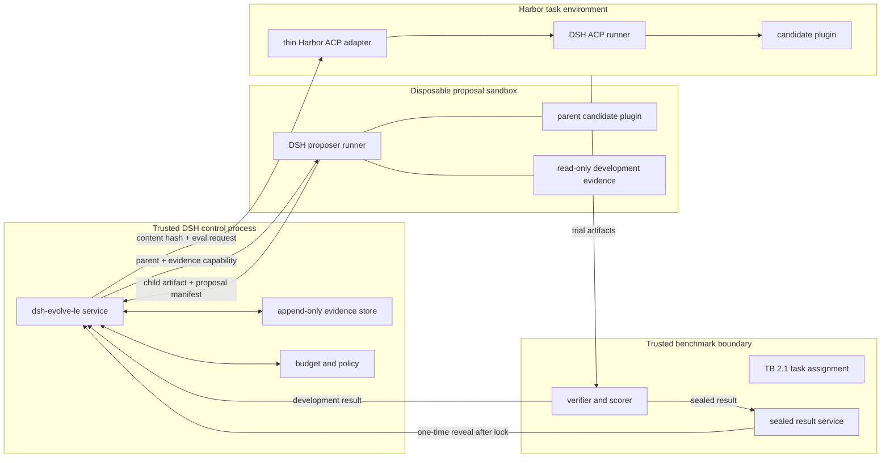

# 01 — System architecture

**Status:** normative draft  
**Decision:** trusted DSH plugin control plane + isolated DSH candidate runtimes + pluggable benchmark provider

## 1. Architecture outcome

最优边界不是“DSH 外的 evolution controller 调 DSH”，也不是“把不可信 candidate 热加载进
controller”。它是三个不同信任域：

1. **可信控制域**：一个长期运行的 DSH Cordis service，拥有策略、证据索引和预算。
2. **不可信候选域**：一次性 DSH 进程，加载一个 immutable candidate bundle，分别承担 proposal
   或 task-solving；退出后整个进程域销毁。
3. **可信评测域**：Harbor/TB provider，拥有 task assignment、verifier、结果归一化和 sealed 数据。



箭头只表示显式消息/artifact 传递。candidate 没有返回 controller 地址、证据目录或 verifier 的
能力；controller 不执行 candidate code。

## 2. Why this uses DSH at the core

### 2.1 Control plane is a Cordis service

`@dsh-evolve-le/core` 作为 DSH bundle 安装，并只对内部消费者提供一个 `ctx.selfEvolving` service。Archive、
scheduler、proposer coordination、budget 和 state reducer 是该 service 内的模块，而不是五个必须
独立部署的微服务。

推荐 Loader namespace 形态：

```ts
import type { Context } from '@deepseek-ai/cordis'

export const name = 'dsh-evolve-le'
export const inject = ['subprocess']

export function apply(ctx: Context, config: Config) {
  // Construct one service; all listeners and background work are ctx-owned effects.
}
```

长期资源 MUST 通过 `ctx.effect()` 注册 disposer；事件监听、timer 和 child Fiber 使用 Cordis
lifecycle。controller unload 必须等待 journal flush、取消未提交 launch、保留可 reconcile 的
external job ID，然后完全 quiesce。

### 2.2 Candidate is a native DSH plugin

候选不实现另一种 agent abstraction。它通过标准 DSH services/events 扩展真实 agent loop：

- prompt 由 `systemPrompt` contribution 组成；
- tools 通过 `ctx.tools` 注册、呈现或限制；
- runtime behavior 通过 `agent/*`、`session/event`、`tools/result` 等事件实现；
- scoped 行为在 `ctx.agents.create({ setup })` 的 agent context 内挂载；
- unload/reload 依赖 Cordis effect/Fiber 的可逆性。

这样 evolution 搜索的是 DSH 自己的组合面，而不是一个失真的 mock harness。

### 2.3 Dynamic composition is lifecycle, not security

DSH 的 `ctx.dynamicCordisRunner` 使用 `node:vm` 和 Fiber 撤销，适合可信模型临时装配功能；其官方
trust stance 明确说明 vm 不是 security boundary，声明的 services 可触达真实 runtime。

因此它 MAY 用于：

- developer preview；
- 已通过审核候选的无 benchmark 手工演示；
- 验证 effect 可逆性的测试 fixture。

它 MUST NOT 用于：

- 在 controller 进程执行 proposer 生成的 candidate；
- 隔离 verifier、secrets、sealed results 或预算；
- 证明 malicious candidate 安全。

生产评测始终启动新的 OS process/container，并用 artifact hash 选择 candidate。

## 3. Logical components

组件是代码职责，不等于独立进程。

| Component              | Lives in                       | Responsibility                              | Explicitly does not own            |
| ---------------------- | ------------------------------ | ------------------------------------------- | ---------------------------------- |
| RSI service            | controller DSH                 | state transition, scheduling, policy        | candidate execution, scoring       |
| Archive reducer        | RSI service                    | immutable lineage, statistics, Pareto views | acceptance claims                  |
| Selector               | RSI service                    | UCB-Air, Thompson, reservations             | proposal content                   |
| Proposal coordinator   | RSI service                    | create sandbox request, validate output     | running candidate code locally     |
| Artifact builder       | disposable builder             | typecheck, bundle, hash, scan               | model calls, benchmark score       |
| Candidate plugin       | proposal/task sandbox          | evolvable harness behavior                  | TCB and secrets                    |
| Benchmark provider API | RSI service seam               | submit/reconcile/collect by idempotency key | benchmark-specific process details |
| TB provider            | adapter package                | Harbor config/CLI, result normalization     | Archive, selection, promotion      |
| Sealed service         | separate trusted process/store | hide assignment/results, one-time reveal    | proposal or parent selection       |

只有有第二个 benchmark consumer 时才实现第二个 provider；接口先针对 TB 所需最小集合。

## 4. Repository target layout

```text
dsh-evolve-le/
├── packages/
│   ├── dsh-evolve-le/                  # bundle + one public Cordis service
│   │   ├── src/
│   │   │   ├── index.ts
│   │   │   ├── controller.ts
│   │   │   ├── state-reducer.ts
│   │   │   ├── archive.ts
│   │   │   ├── selector.ts
│   │   │   ├── proposal-coordinator.ts
│   │   │   ├── budget.ts
│   │   │   └── benchmark-provider.ts
│   │   ├── cordis.patch.yml
│   │   └── package.json
│   ├── candidate-sdk/            # types, validators, testkit; no policy
│   └── tb-agent/                 # stable DSH ACP application shell
├── benchmark-adapters/
│   └── terminal-bench/
│       └── src/                  # TypeScript Harbor job/config provider
├── schemas/                      # versioned JSON schemas
├── tests/
│   ├── loader-e2e/
│   ├── crash-replay/
│   └── harbor-e2e/
├── evidence/                     # runtime only; see 06
├── specs/
└── docs/
```

`deepseek-harness/`、`harbor/`、`tb/` 是本地参考 checkout，不成为可编辑 package。依赖必须通过
固定 commit、发布包或可复现 artifact 声明。

## 5. Process topology

### 5.1 Controller process

controller 是唯一 journal writer。它可以并行等待多个 external job，但每次策略决策在单线程
state reducer 上序列化：

```text
reconcile completed work -> reduce events -> reserve action -> append intent
-> launch external work -> append launch receipt -> continue
```

并发不是多个 controller。文件锁拒绝第二个 writer；read-only UI/analysis 可读取 snapshot。

### 5.2 Proposal sandbox

每次 expansion 创建全新 sandbox，包含：

- 只读 parent candidate artifact；
- 只读、经过 label filter 的 development evidence filesystem；
- 只读 candidate SDK、接口文档和固定 runner contract；
- 仅 `/work/child` 可写；
- 通过 trusted gateway 暴露的固定 proposer route；
- 无 controller source、sealed store、benchmark tests、credential file 或 Docker socket。

proposer 以 DSH agent 运行，parent candidate 以 `mode=propose` 通过真实 Loader 装载。输出是 child
source tree 和机器可读 proposal manifest；自然语言 rationale 不是执行授权。

### 5.3 Builder sandbox

builder 不调用 LLM。它从只读 child source 构建：

1. canonical source tar；
2. compiled candidate bundle；
3. self-contained evaluation capsule；
4. SBOM、dependency lock、scan report 和 SHA-256。

candidate ID 从 canonical source hash 派生，controller 名称只是可读别名。构建必须禁用未批准的
install scripts 和网络，避免 proposal 通过依赖安装越界。

### 5.4 Task sandbox

Harbor 为每个 trial 创建任务环境。TypeScript provider 为 candidate capsule 生成 inline ACP registry
record；其 `binary` distribution 指向 immutable HTTPS artifact 并带 SHA-256。Harbor 的通用 ACP
runner 下载、校验、解包并启动 capsule 中的 `dsh-evolve-le-acp`，后者是编译后的 DSH ACP stdio server：

```text
Harbor BaseAgent lifecycle
  -> resolve inline ACP binary distribution
  -> download and verify capsule SHA-256
  -> launch DSH ACP server with candidate patch
  -> ACP session/new(cwd)
  -> ACP prompt(task instruction)
  -> collect ATIF + DSH session evidence
  -> terminate DSH control process
  -> Harbor verifier
```

项目不实现 Python `BaseAgent`，也不复制 ACP client。若某个本地开发环境不能提供 HTTPS artifact，
MAY 在独立 spike 中增加一个只上传 capsule 的薄 adapter；在真实需求和 contract test 出现前不创建。

## 6. Stable runner versus evolvable candidate

为了使比较可归因，evaluation capsule 分两层：

```text
stable tb-agent shell
├── ACP transport and stdout purity
├── model adapter and exact route
├── session persistence/trajectory export
├── sandbox, budget and permission providers
├── base tool capability providers
└── Loader slot: candidate bundle (only changing layer)
```

candidate 可以改变模型所见与 agent workflow，但不能替换 transport、model adapter、budget meter、
sandbox provider 或 trajectory recorder。runner 在每次 request 记录完整 effective header/tool schema，
从而识别 candidate 的真实影响。

## 7. Benchmark provider seam

TypeScript 内部接口保持窄且可恢复：

```ts
interface BenchmarkProvider {
  preflight(request: PreflightRequest): Promise<PreflightReceipt>
  submit(request: EvaluationRequest): Promise<ExternalJobReceipt>
  inspect(externalJobId: string): Promise<ExternalJobState>
  collect(externalJobId: string): Promise<EvaluationArtifactRef>
  cancel(externalJobId: string, reason: string): Promise<CancelReceipt>
}
```

约束：

- `request.idempotencyKey` 相同的 submit MUST 返回同一 job 或明确冲突，不能再跑一份。
- provider 返回事实和 artifact 引用，不返回“accept candidate”。
- controller 只从归一化、schema-valid 的逐 trial record 更新 Archive。
- provider 的 CLI/stdout 不是证据真源；Harbor job directory 和逐 trial `result.json` 才是。
- adapter upgrade 会改变 provider fingerprint，需要新 run lineage。

## 8. DSH integration seams

实现优先使用以下已有能力，而不复制它们：

| Need                         | DSH seam                                       |
| ---------------------------- | ---------------------------------------------- |
| public RSI capability        | Cordis `Service` / context declaration merging |
| cleanup and rollback         | `ctx.effect`, Fiber disposal                   |
| dependency readiness         | `inject` and reactive service lifecycle        |
| proposer agent creation      | `ctx.agents.create({ setup })`                 |
| per-agent candidate behavior | `agentCtx` registrations                       |
| behavior observation         | `agent/*`, `session/event`, `tools/result`     |
| managed external processes   | `ctx.subprocess` provider                      |
| durable agent trace          | session persistence/event stream               |
| programmatic task transport  | DSH ACP server + Harbor ACP client             |
| local package distribution   | DSH bundle/profile/patch conventions           |

具体且经源码核对的用法见 [`../docs/dsh-integration.md`](../docs/dsh-integration.md)。

## 9. Data-flow labels

每个 artifact 在创建时 MUST 带一个不可变 label：

| Label          |     Candidate runtime | Proposer |               Selector | Public report before unseal |
| -------------- | --------------------: | -------: | ---------------------: | --------------------------: |
| `PUBLIC_SPEC`  |                  read |     read |                   read |                         yes |
| `DEV_OBSERVED` |       task-local only |     read |                   read |              aggregate only |
| `DEV_GUARD`    |       task-local only |       no |         aggregate only |                          no |
| `SEALED`       | final task-local only |       no |                     no |                          no |
| `TCB_SECRET`   |                    no |       no | necessary service only |                          no |

过滤 MUST 在创建 sandbox 之前由 trusted store 执行，而不是靠 prompt 告诉 proposer 不要读。

## 10. Failure containment

- Candidate compile/load failure only fails that proposal; controller remains live.
- Candidate runtime crash only fails that trial; missing reward maps to zero unless classified infrastructure failure.
- Harbor/provider outage leaves a reconcilable external job receipt；controller resume 先 inspect，不能盲重跑。
- Journal/hash mismatch stops all mutation and paid work with `EVIDENCE_CORRUPT`。
- Budget service denial cannot be overridden by candidate、proposer 或 operator prompt；需要新 signed manifest。
- Sealed-service contact before candidate lock permanently invalidates run lineage。

## 11. Scaling path

第一版先用一个 controller process 和文件事件日志。只有以下证据出现后才增加实体：

- 单 writer reducer 成为经测量瓶颈时，引入 queue；
- evidence 超出本地盘/单机容错需求时，引入 object store；
- 第二个 benchmark 已有真实 adapter 时，稳定通用 provider package；
- 多机同时写 Archive 成为明确需求时，引入事务数据库。

这些扩展不能改变 candidate contract、artifact identity 或实验语义。
